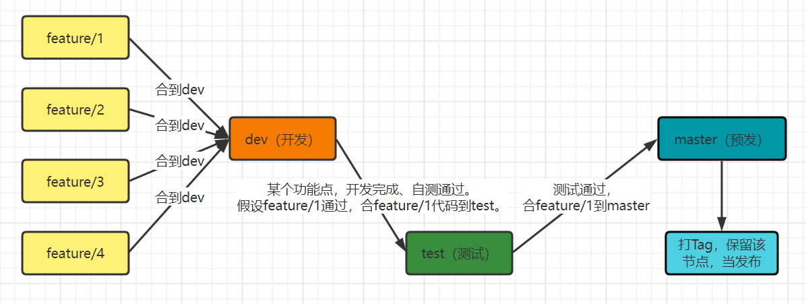

### 简介

---

#### 1）Git有啥必要学？

- 代码备份
- 版本控制
- 协同开发

##### 代码备份

​	在现如今IDEA的流行下，此项功能就没那么重要了，因为IDEA会自动保存代码。有人会说你磁盘也会炸啊，那不是也会丢失？磁盘的保护数据的能力是非常高的，电脑炸了，它换个电脑，只要有对应的接口，一样能看到数据！

##### 版本控制

​	在开发时，一起开发的或者单独开发的，为了保证各个功能的相对独立和上线流程的完整可靠，会建立各种分支并及时提交和合并（下面再讲）。功能分支推荐"feature/"+功能名称，以mysql数据库表名为参考；上线流程如下图。



##### 协同开发

​	可以分为同功能开发者的协同、leader对你的代码进行审查监督、对代码提交重大失误的追责。

#### 2）洗脑完毕，开冲

- 入门准备
- 命令大全

##### 入门准备

- 下载及安装（[Git - Downloads (git-scm.com)](https://git-scm.com/downloads)）
- 创建库（gitee或github，都行）

##### 命令大全

在看命令前，还需要知道一些存储概念，在宏观上认识git。

- 工作区：在工作区的文件，从一定意义上可以说与git无关。.gitignore文件中标识的忽略文件，就会一直存在工作区。
- 暂存区：面向工作区，本地代码想进入本地仓库前的必要位置。
- 本地仓库：面向暂存区和远端仓库，是本地与远端代码管理的判断依据，会记录变化日志。
- 远程仓库：面向本地仓库，在交互时，会进行比较版本，完成如**推、拉、克隆**等操作。

**基本流程命令**

```shell
#找个文件夹，打开git bash窗口或者cmd窗口，克隆下代码（不克隆，自己本地创建即init，道理差不多，最后提）
#常用两种地址：
#	https:clone无身份要求，后面提交等操作时需要配置账号密码。
#	ssh:clone需要配置ssh，如果可以用，尽量用这个，不会暴露账号密码。
git clone [仓库的https或ssh地址]
#配置账号密码（使用ssh可以跳过）

#随便新建个文件后，需要先add到暂存区，参数为文件名或通配符
git add .
#文件到暂存区之后再进行提交，才会成功，需要添加注释，方便人阅读
git commit -m '注释'
#成功提交后，文件会到本地仓库，此时需要推送到远端仓库，实现git最直观的功能
git push
```


